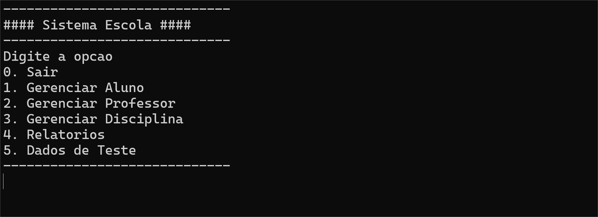

# Pojeto Escola

Projeto realizado como trabalho para a matéria INF029(Laboratório de Programação), dada pelo professor Renato Novais.


## Linguagem Utilizada


## Funcionalidades

- CRUD ✅
    - Gerenciar de Alunos ✅
    - Gerenciar de Professores ✅
    - Gerenciar de Desciplinas ✅
- Relatórios
    - Alunos e Professores
        - Listar ✅
        - Listar por sexo (Masculino/Feminino) ✅
        - Listar ordenados por Nome ✅
        - Listar ordenados por data de nascimento
        - Listar por Maximo de Disciplinas ✅


    - Aniversariantes do mês ✅

    - Lista de pessoas (professor/aluno) a partir de uma string de busca. O usuário informa no mínimo três letras e deve ser listado todas as pessoas que contem essas três letras no nome 
    
    - Lista de Disciplinas, com nome do professor, por mínimo de vagas.✅

## Execute Localmente

Clone o projeto

```bash
git clone https://github.com/johncobain/projeto-escola.git
```

Vá para o diretório do projeto

```bash
cd projeto-escola
```

Compile o programa

```bash
gcc projeto\*.c -o escola.exe
```

Execute o programa

```bash
escola.exe
```


## Autores

- [@johncobain](https://github.com/johncobain)
- [@uKuroo](https://github.com/uKuroo)
- [@Guiv4sques](https://github.com/Guiv4sques)

## Professor

- [@renatoln](https://github.com/renatoln)